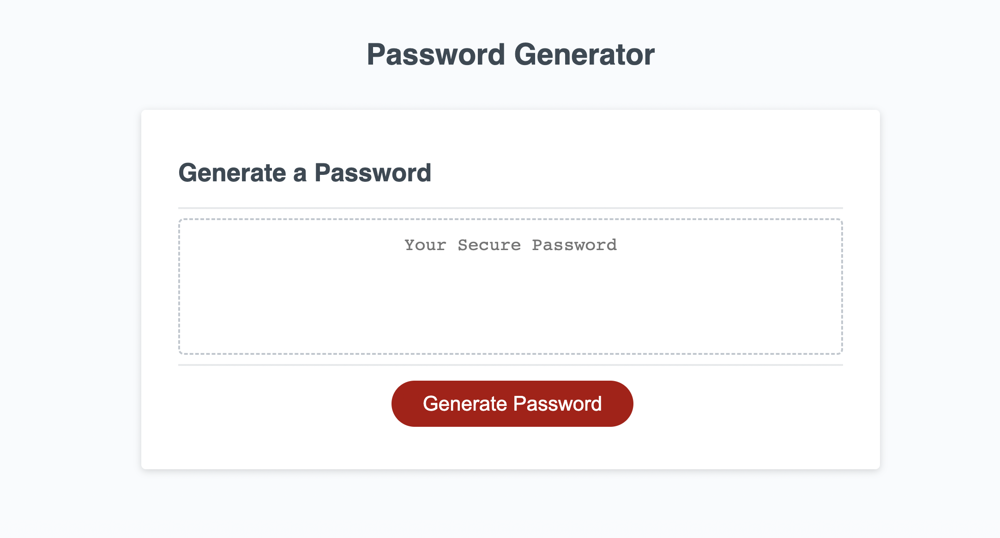

# Password-Generator

## Description
The page will allow the user to create a randomly generated, custom password based upon the criteria that they will provide. 
## Installation
N/A

## Usage
The purpose of this application si to generate a secure password based off criteria that the user provides. The second added button allows the user to copy the password to their clipboard.

## Credits
https://w3collective.com/random-password-generator-javascript/
Very helpful website when it came to producing the password based off the criteria provided

## License
N/A

## Link to Application
[Link to application](https;//cgordon5025.github.io/Password-Generator/)